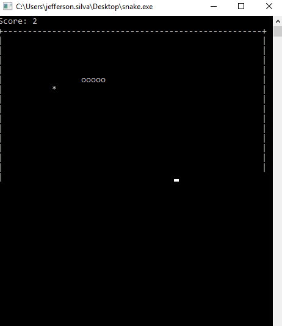

## Snake game built in C using printf()

  

Projeto feito na época da faculdade(2015) quando ainda estava aprendendo C, uma amiga propos que
eu fizesse um jogo em c sem usar biblioteca gráfica e então achei que talvez o jogo snake fosse o mais fácil
pra concluir esse desafio.

Vasculhando o Drive encontrei esse projeto e decidi que seria uma boa ideia guarda-lo em um repositório no github.
